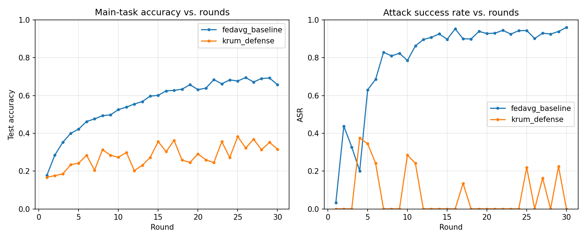

# Backdoor Attacks in Federated Learning — Remediation

IEEE GSC 2026, Challenge 1. Federated learning on CIFAR-10 with non-IID clients,
a BadNets backdoor attack, and Byzantine-robust aggregation defenses.

## Problem statement

Federated learning lets clients train a shared model without sharing raw data,
but a malicious client can poison its local updates to implant a **backdoor**:
the global model behaves normally on clean inputs but misclassifies any input
carrying a fixed trigger pattern into an attacker-chosen target class. This
repo implements the attack, a training/eval pipeline that measures it
(accuracy on the real task vs. Attack Success Rate on triggered inputs), and
Byzantine-robust aggregation defenses evaluated against it.

## Approach

- **Framework**: [Flower](https://flower.ai/) (`flwr`) for the client/aggregation
  abstractions, PyTorch for the model.
- **Data**: CIFAR-10, partitioned across clients with a symmetric
  Dirichlet(α) distribution per class (`src/fl/data.py`) to control non-IID
  label skew — lower α means more skewed, non-IID client data.
- **Model**: a small 3-conv CNN (`src/fl/models.py`), sized so a full
  multi-round simulation with many clients finishes in minutes.
- **Attack — BadNets** (`src/attacks/badnets.py`): malicious clients patch a
  fixed 4x4 pixel trigger into a fraction of their local training images and
  flip the label to a fixed target class. Attack Success Rate (ASR) is
  measured by triggering every non-target-class test image and checking what
  fraction the global model classifies as the target class.
- **Defenses** (`src/defenses/aggregation.py`): thin wrappers around Flower's
  own `aggregate` (FedAvg) and `aggregate_krum` (Krum / Multi-Krum)
  implementations, so the aggregation math is Flower's, not reimplemented.
- **Simulation driver** (`src/fl/experiment.py`): a sequential round loop that
  drives real `flwr.client.NumPyClient` instances and feeds their results
  into Flower's aggregation functions. **Note**: `flwr.simulation.start_simulation`
  (Ray-backed) is not used — Ray currently has no published wheel for
  Python 3.13, so the client-sampling / fit / aggregate / evaluate loop that
  Ray would otherwise orchestrate across actors is driven by hand instead.
  Everything else (the client abstraction, the aggregation implementations)
  is still genuine Flower code.

## Results (Day 1: FedAvg baseline vs. Krum)

Setup: 20 clients, Dirichlet α=0.5, 20% malicious (4 clients), 50% local
poison rate, 30 rounds, 50% client participation per round.

| Strategy | Final accuracy | Final ASR |
|---|---|---|
| FedAvg (no defense) | ~0.66 | ~0.96 |
| Krum (single-Krum) | ~0.32 | ~0.00 |



FedAvg has no way to distinguish a poisoned update from a benign one, so the
backdoor is learned almost as fast as the main task and persists at ~96% ASR.
Krum fully suppresses it (ASR → 0) by aggregating only the single most
"representative" client update each round instead of averaging — but under
non-IID data that also means it's regularly discarding good, unusual-but-honest
updates along with the bad ones, which is why its accuracy plateaus far below
FedAvg's. This accuracy/robustness tradeoff under heterogeneity is a known
weakness of Krum and motivates the further defenses (FLTrust, FLAME) planned
for Day 2.

Raw per-round metrics: `results/metrics/fedavg_baseline.json`,
`results/metrics/krum_defense.json`.

## How to run

```bash
pip install -r requirements.txt

# FedAvg baseline (BadNets attack, no defense)
python scripts/run_fedavg_baseline.py

# Krum defense (same attack setup)
python scripts/run_krum_defense.py

# Regenerate the comparison plot from results/metrics/*.json
python -m src.fl.plotting
```

GPU is used automatically if available (`torch.cuda.is_available()`); CIFAR-10
downloads to `./data/` on first run.

## Repo layout

```
src/fl/          data partitioning, model, Flower client, simulation driver, plotting
src/attacks/     BadNets trigger + poisoned-dataset wrappers
src/defenses/    aggregation strategy wrappers (FedAvg, Krum)
scripts/         one experiment per script (config + entry point)
results/metrics/ per-round JSON metrics for each run
results/plots/   generated comparison plots
```

## Status

Day 1 (attack + baseline + first defense) complete. Day 2 plan: DBA
(distributed backdoor attack), FLTrust defense, FLAME defense (stretch), full
evaluation plots across the attack/defense matrix.
