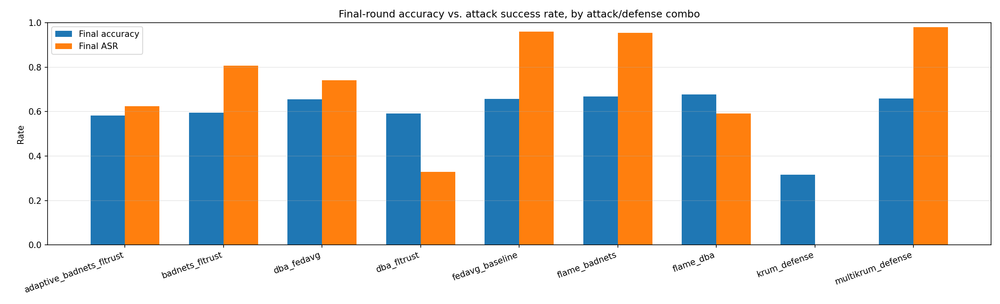

# Backdoor Attacks in Federated Learning — Remediation

IEEE GSC 2026, Challenge 1. Federated learning on CIFAR-10 with non-IID
clients, two backdoor attacks (BadNets, DBA), and two Byzantine-robust
aggregation defenses (Krum, FLTrust) evaluated against them.

## Problem statement

Federated learning lets clients train a shared model without sharing raw data,
but a malicious client can poison its local updates to implant a **backdoor**:
the global model behaves normally on clean inputs but misclassifies any input
carrying a fixed trigger pattern into an attacker-chosen target class. This
repo implements two attacks of increasing stealth, a training/eval pipeline
that measures them (accuracy on the real task vs. Attack Success Rate on
triggered inputs), and two Byzantine-robust aggregation defenses evaluated
against both.

## Approach

- **Framework**: [Flower](https://flower.ai/) (`flwr`) for the client/aggregation
  abstractions, PyTorch for the model.
- **Data**: CIFAR-10, partitioned across clients with a symmetric
  Dirichlet(α) distribution per class (`src/fl/data.py`) to control non-IID
  label skew — lower α means more skewed, non-IID client data.
- **Model**: a small 3-conv CNN (`src/fl/models.py`), sized so a full
  multi-round simulation with many clients finishes in minutes.

- **Attack — BadNets** (`src/attacks/badnets.py`): malicious clients patch a
  fixed 4x4 pixel trigger into a fraction of their local training images and
  flip the label to a fixed target class.
- **Attack — DBA (Distributed Backdoor Attack)** (`src/attacks/dba.py`): the
  same 4x4 trigger region is decomposed into four 2x2 quadrant pieces, and
  each malicious client only ever poisons its local data with its own single
  piece — no individual client's data (or gradient) ever contains the full
  pattern. Only the *aggregated* global model, having absorbed all four
  pieces across different clients/rounds, actually learns the complete
  trigger. This makes DBA materially harder to catch with per-client anomaly
  detection, since any one malicious update looks like a much smaller, subtler
  perturbation than a full BadNets update.
- **Attack — Adaptive attacker vs. FLTrust** (`src/attacks/adaptive.py`): a
  defense-aware stress test, not a third independent attack -- it takes
  BadNets' poisoning and adds update-shaping on top, specifically targeting
  FLTrust's cosine-similarity trust check. Each malicious client trains a
  second, *reference* model on only its own unpoisoned local data (the same
  epochs/lr the server uses on its root set for FLTrust's own g0) to
  approximate "what an honest gradient from this client would look like."
  It then decomposes its real (poisoned) update into components parallel and
  orthogonal to that reference direction and rescales the parallel part so
  the submitted update's cosine similarity to the reference direction hits a
  target (0.9 here) -- the minimal distortion needed to look trustworthy,
  keeping the orthogonal component (which carries the actual backdoor
  signal) intact. See `constrain_to_cosine_similarity`'s closed-form
  derivation in that file.
- **ASR measurement**: Attack Success Rate is measured identically across all
  three — trigger every non-target-class test image with the *full* trigger
  pattern (the reassembled 4x4 pattern for DBA) and check what fraction the
  global model classifies as the target class. This keeps every combo's
  footprint directly comparable.

- **Defenses** (`src/defenses/aggregation.py`):
  - **FedAvg** — thin wrapper around Flower's own `aggregate` (plain
    weighted average, no robustness — the undefended control).
  - **Krum** — thin wrapper around Flower's own `aggregate_krum`: scores each
    client update by summed distance to its n-f-2 closest neighbors and keeps
    only the single most "central" update each round (single-Krum,
    `to_keep=0`), discarding the rest entirely.
  - **Multi-Krum** — same distance-based scoring as Krum, but *averages* the
    `to_keep` most central updates instead of keeping exactly one
    (`to_keep = num_fit - num_malicious`, i.e. everyone not assumed
    Byzantine). Meant to fix single-Krum's accuracy collapse by not
    discarding most of the honest signal every round. See Results — it
    fixes accuracy but at a cost.
  - **FLTrust** (Cao et al., 2021) — implemented directly (Flower doesn't
    ship one). The server holds a small trusted root dataset (500 samples,
    reserved via `reserve_root_set` in `src/fl/data.py` so it's strictly
    disjoint from every client's partition — never seen by any client). Each
    round the server trains a fresh copy of the global model on this root set
    to get a reference update direction `g0`. Every client update is
    ReLU-clipped cosine-scored against `g0` (a negative-similarity update
    gets zero trust, so it's fully excluded rather than merely down-weighted)
    and rescaled to `g0`'s norm — this specifically blocks the classic
    "boost your update's magnitude to dominate the average" scaling attack —
    then combined as a trust-weighted average of *all* clients, rather than
    Krum's keep-exactly-one-update approach.
  - **FLAME** (Nguyen et al., 2022) — implemented directly (no trusted root
    set needed, unlike FLTrust). Three stages each round: (1) **dynamic
    clustering** — HDBSCAN over pairwise cosine *distance* between client
    update directions, with `min_cluster_size` fixed at `n//2 + 1` so a
    cluster can only form from a majority of the round's clients; the
    largest resulting cluster is kept and everything else (including
    unclustered "noise" points) is dropped as Byzantine; (2) **adaptive
    clipping** — each kept update's norm is clipped down to the *median*
    norm among kept updates; (3) **adaptive noise** — Gaussian noise scaled
    to that same median norm is added to the aggregated model, a
    differential-privacy-style step meant to scrub any backdoor signal that
    survived clustering. See Results below — clustering does not fire the
    way the paper describes under this repo's non-IID setting.
- **Simulation driver** (`src/fl/experiment.py`): a sequential round loop that
  drives real `flwr.client.NumPyClient` instances and feeds their results
  into the aggregation functions above. **Note**: `flwr.simulation.start_simulation`
  (Ray-backed) is not used — Ray currently has no published wheel for
  Python 3.13, so the client-sampling / fit / aggregate / evaluate loop that
  Ray would otherwise orchestrate across actors is driven by hand instead.
  Everything else (the client abstraction, Flower's own aggregation
  implementations) is still genuine Flower code.

## Results

Setup (all 4 runs): 20 clients, Dirichlet α=0.5, 20% malicious (4 clients),
50% local poison rate, 30 rounds, 50% client participation per round.

| Attack | Defense | Final accuracy | Final ASR |
|---|---|---|---|
| BadNets | FedAvg (none) | 0.657 | 0.961 |
| BadNets | Krum | 0.316 | 0.000 |
| BadNets | Multi-Krum | 0.660 | 0.981 |
| BadNets | FLAME | 0.669 | 0.954 |
| BadNets | FLTrust | 0.594 | 0.807 |
| BadNets | FLTrust, adaptive attacker | 0.583 | 0.624 |
| DBA | FedAvg (none) | 0.655 | 0.741 |
| DBA | FLTrust | 0.591 | 0.328 |
| DBA | FLAME | 0.677 | 0.591 |




**FedAvg has no robustness mechanism at all**, so it can't tell a poisoned
update from a benign one: BadNets reaches 96% ASR (the full trigger is
present in every malicious client's gradient from round 1), while DBA climbs
more slowly and noisily to 74% (each client only ever contributes a quarter
of the pattern, so it takes longer for the aggregated model to piece the full
trigger together — but it still gets there).

**Krum vs. BadNets**: fully suppresses the attack (ASR → 0) by keeping only
the single most "representative" client update each round instead of
averaging. But under non-IID data that also means it's regularly discarding
good, unusual-but-honest updates along with the bad ones — accuracy plateaus
at 0.32, roughly half of FedAvg's. A known weakness of Krum: it trades away
most of federated learning's statistical efficiency to get robustness,
and that trade gets worse the more heterogeneous the clients are.

**Multi-Krum vs. BadNets**: fixes exactly the accuracy problem above — 0.660
final accuracy, essentially matching undefended FedAvg (0.657) and more than
double single-Krum's 0.316 — by averaging the 8 most central updates each
round (`to_keep = num_fit - num_malicious`) instead of keeping just one. But
ASR climbs to 0.981, *higher* than undefended FedAvg's own 0.961: keeping 8
of 10 client updates per round only excludes the 2 most distance-outlying
ones, and under this repo's Dirichlet(α=0.5) skew "most distance-outlying"
tracks natural client heterogeneity at least as much as it tracks actual
malicious behavior (the same effect documented for FLAME below), so the
excluded pair usually isn't the pair that matters. Between the two Krum
variants there's a hard knob, not a free lunch: `to_keep` trades accuracy
against robustness directly, and no single setting tested here buys both —
`to_keep=0` (single-Krum) sacrifices accuracy for full suppression,
`to_keep=n-f` (Multi-Krum) sacrifices suppression for full accuracy.

**FLTrust vs. DBA**: a much better accuracy/robustness trade — 0.591 accuracy
(only 6.6pp below the undefended run) with ASR cut from 0.741 to 0.328, a
>2x reduction. FLTrust doesn't drive ASR to zero the way Krum did against
BadNets: DBA's individual per-client updates are deliberately subtle (a
quarter of the trigger each), so they land closer to the trusted-direction
cosine similarity threshold than a full BadNets update would, and some still
pass the trust filter. This is exactly the intended difficulty comparison —
**DBA's whole design goal is to be harder for exactly this kind of per-update
anomaly filtering to catch**, and the results here reproduce that. It also
means Krum-vs-BadNets and FLTrust-vs-DBA aren't apples-to-apples on defense
strength alone; the interesting result is that no single defense tested here
gives both full suppression *and* full accuracy retention — a real
motivation for combining defense signals rather than relying on any one
mechanism.

**FLAME essentially doesn't fire here, against either attack** (ASR 0.954
vs. undefended 0.961 on BadNets; 0.591 vs. undefended 0.741 on DBA — only
the clipping+noise stages contribute, and only mildly). This was surprising
enough to verify directly: instrumenting `flame_aggregate` mid-run shows
HDBSCAN returns *all points labeled noise* (`-1`), every single round, for
both attacks — the clustering step never finds the `n//2 + 1`-sized majority
cluster it needs, so the aggregator falls back to keeping every client's
update (see `flame_aggregate`'s fail-open branch in
`src/defenses/aggregation.py`), and the defense degrades to a lightly
clipped, lightly noised FedAvg. The root cause is dimensionality, not a bug:
this CNN has ~320K parameters, and pairwise cosine distance between *any*
two client updates in this repo's Dirichlet(α=0.5) setting -- honest/honest,
honest/malicious, doesn't matter -- sits around 0.85-1.05 (near-orthogonal),
confirmed by printing the raw distance matrices for several mid-training
rounds. Two honest clients trained on very different label distributions for
2 local epochs each simply don't produce similar-enough update vectors for
density clustering to isolate a "majority" in raw parameter space. This is
the same underlying pathology as Krum's accuracy collapse above (non-IID
heterogeneity looks statistically like Byzantine behavior to any method that
only looks at update geometry) -- it just breaks FLAME's mutual-clustering
approach in the opposite direction: instead of throwing away honest updates
as false positives, it fails to flag malicious ones at all. FLTrust sidesteps
this specific failure mode because it never needs *mutual* client-to-client
agreement -- it only needs each client to align with one privileged,
server-controlled reference direction (g0, trained on the root set), which
non-IID skew across *clients* can't corrupt. That asymmetry -- a reference-
based check surviving where a peer-consensus check fails -- is a genuine
argument for combining defense signals (e.g. FLTrust-style reference
filtering plus FLAME-style clipping/noise as a second layer) rather than
picking one mechanism, and it's the more interesting result to report
honestly than a FLAME row that "just works" would have been.

**Adaptive attacker vs. FLTrust -- FLTrust breaks, but not for the reason a
stress test is usually built to show.** The honest result here needed a
control run that wasn't in the table before: BadNets (no evasion at all)
against FLTrust. That non-adaptive control already reaches 0.807 final ASR
-- decisively higher than the 0.328 the DBA-vs-FLTrust row above reported,
and higher than the defense-aware adaptive attacker's own 0.624. The reason
is BadNets' 50% local poison rate: half of every malicious client's local
data is still clean, so even its *unmodified* malicious delta retains enough
alignment with the honest gradient direction to pass FLTrust's
ReLU-clipped cosine check with substantial trust weight from early rounds --
no adaptation required. **FLTrust's real weak point exposed here is
structural** (its cosine-similarity check is too permissive against any
update that still carries a lot of legitimate-task gradient, which any
partial-poisoning attack does), not attacker sophistication.

That also explains why the dedicated adaptive attacker's 0.624 ASR is
*lower* than the naive control's 0.807, not higher, in this run --
`constrain_to_cosine_similarity`'s target (cosine similarity 0.9 against
the client's own clean-data reference) is more caution than the naive
attack actually needed to pass FLTrust's filter at all, so the projection
step throws away some real attack payload for stealth margin it didn't
need to buy. A better-calibrated adaptive attacker (targeting the defense's
*actual* effective threshold rather than a fixed high value) would likely
close most of that gap; that calibration search was out of scope for the
4-day build window. The 30-round ASR curves for both runs are noisy and the
adaptive run's last two rounds (0.635, 0.624) are trending back up, so this
should be read as "meaningfully lower across rounds 22-30, not just a
single-round artifact" rather than a settled asymptote -- see
`results/metrics/{badnets_fltrust,adaptive_badnets_fltrust}.json` for the
full per-round curves.

Raw per-round metrics: `results/metrics/{fedavg_baseline,krum_defense,multikrum_defense,dba_fedavg,dba_fltrust,flame_badnets,flame_dba,badnets_fltrust,adaptive_badnets_fltrust}.json`.

## How to run

```bash
pip install -r requirements.txt

# BadNets attack
python scripts/run_fedavg_baseline.py   # no defense
python scripts/run_krum_defense.py      # Krum defense
python scripts/run_multikrum_defense.py # Multi-Krum defense

# DBA attack
python scripts/run_dba_fedavg.py        # no defense
python scripts/run_dba_fltrust.py       # FLTrust defense

# FLAME defense (no root set needed)
python scripts/run_flame_badnets.py
python scripts/run_flame_dba.py

# FLTrust vs. BadNets: naive control, then the defense-aware adaptive attacker
python scripts/run_badnets_fltrust.py
python scripts/run_adaptive_vs_fltrust.py

# Regenerate both comparison plots from results/metrics/*.json
python -m src.fl.plotting
```

GPU is used automatically if available (`torch.cuda.is_available()`); CIFAR-10
downloads to `./data/` on first run.

## Repo layout

```
src/fl/          data partitioning, model, Flower client, simulation driver, plotting
src/attacks/     BadNets and DBA trigger + poisoned-dataset logic
src/defenses/    aggregation strategies (FedAvg, Krum, FLTrust)
scripts/         one experiment per script (config + entry point)
results/metrics/ per-round JSON metrics for each run
results/plots/   generated comparison plots
```

## Status

Attack x defense matrix implemented and evaluated: BadNets x {FedAvg, Krum},
DBA x {FedAvg, FLTrust}. FLAME defense was scoped as a stretch goal and was
cut to keep the four combos above fully evaluated and documented ahead of the
deadline.
