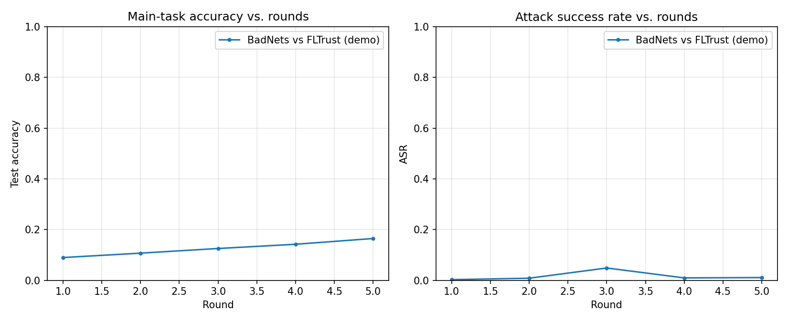
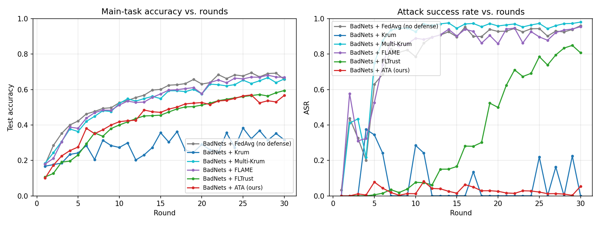
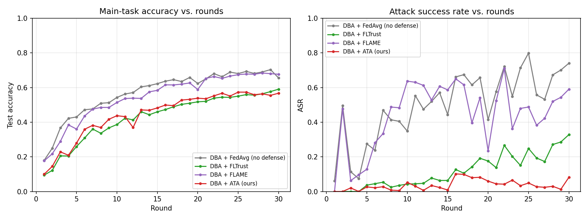
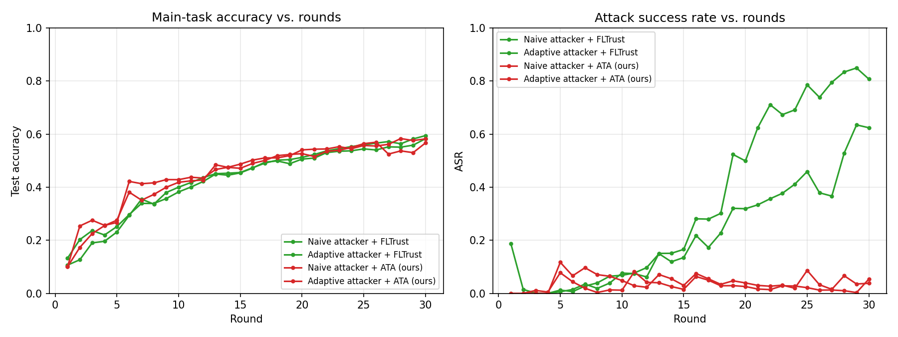
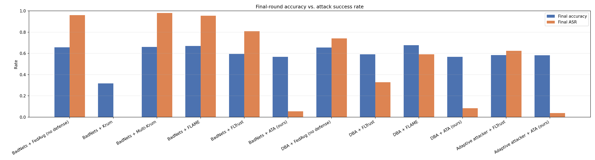

# Backdoor Attacks in Federated Learning — Remediation

IEEE GSC 2026, Challenge 1. Federated learning on CIFAR-10 with non-IID
clients, two backdoor attacks (BadNets, DBA) plus a defense-aware adaptive
attacker stress test, five Byzantine-robust aggregation defenses (Krum,
Multi-Krum, FLTrust, FLAME, and **ATA — this repo's own combined defense**),
and an honest accounting of where each one actually holds and where it
doesn't. 12 attack/defense combinations, all 30 rounds.

## Quick demo

```bash
pip install -r requirements.txt
python scripts/demo.py
```

Runs a scaled-down 15-round BadNets attack (10 clients) side-by-side under
FedAvg (no defense) and ATA, printing round-by-round accuracy/ASR plus a
one-line explanation of what's happening each round, and saves
`results/plots/demo.png` (measured runtime: 257s on GPU):



For the full 30-round, 20-client results behind every number in this
README, see [Results](#results) below and `scripts/run_*.py`.

## Novel contribution: Adaptive Trust Aggregation (ATA)

Everything else in this repo (BadNets, DBA, Krum, Multi-Krum, FLTrust,
FLAME, the constrain-and-scale adaptive attacker) is a faithful
reproduction of a published method. **ATA (`src/defenses/ata.py`) is this
project's own mechanism** — not from a single paper, but built directly in
response to two failure modes this repo measured in its own reproductions:

- **FLTrust's whole-update cosine check is too coarse.** Plain BadNets
  already beats it at 0.807 final ASR with zero evasion, because a
  partially-poisoned update can have positive cosine similarity to the
  trusted direction *on average* while a meaningful block of its
  coordinates pushes the opposite way (see the FLTrust write-up below).
- **FLAME's peer-consensus clustering never fires under this repo's
  non-IID setting.** HDBSCAN's cosine-distance clustering needs a majority
  of clients to look mutually similar; under Dirichlet(α=0.5) skew, honest
  clients don't look similar to *each other* either, so no cluster ever
  forms and the defense silently falls back to accepting everyone (see the
  FLAME write-up below).

ATA stacks three mechanisms into one `aggregate_fn`, chosen so each one
covers a gap the others leave open:

1. **FLTrust-style cosine trust scoring** — a server-trained root-set
   reference direction `g0`, ReLU-clipped cosine similarity per client →
   a trust weight. Kept because a privileged reference direction is what
   let FLTrust survive non-IID skew where FLAME's peer-consensus approach
   failed.
2. **Adaptive clipping** — each trusted client's delta is norm-clipped to
   the *median* norm among clients that received nonzero trust, before
   being folded into the weighted average (FLAME's median-of-accepted
   approach, scoped to the trust-filtered set rather than a cluster).
3. **RLR-style per-coordinate sign correction on the aggregate** — for
   each parameter coordinate, the trust-weighted fraction of clients whose
   sign agrees with the trust-weighted aggregate's own sign there; where
   agreement is below `robust_threshold` (0.7), the aggregate is flipped
   at that coordinate before being applied. This is what targets the
   partial-poisoning gap FLTrust's whole-update cosine score can't see.
   Adapted from Robust Learning Rate (Ozdayi et al., 2021).

**FLAME's HDBSCAN clustering is deliberately not included**, and that's a
design decision worth stating plainly rather than burying: this repo
already measured that clustering never fires under Dirichlet(α=0.5) (every
round returns all-noise labels — see the FLAME write-up below). Stacking a
component known not to activate into ATA would misrepresent what the
defense actually does. Leaving it out is the honest choice given what this
repo has already measured, not an oversight.

**A design mistake worth documenting, not hiding**: the first version of
stage 3 compared each *individual* client's per-coordinate sign directly
against `g0` and flipped disagreeing coordinates before aggregation — a
literal reading of "flip signs that disagree with the trusted root
gradient." A smoke test caught it immediately: training loss went *up*
round-over-round (2.20 → 3.43) instead of down. Diagnosing why found that
`g0` is trained on only 500 root-set samples, so its per-coordinate sign is
itself noisy across this model's ~320K parameters — honest clients
disagreed with it on 37-49% of coordinates, even restricted to `g0`'s top
0.1% most-confident-by-magnitude coordinates, statistically
indistinguishable from malicious clients' 30-61% (measured directly, see
git history for the diagnostic script). Flipping ~40% of every client's
parameters, honest or not, destroys the update — that's what the loss
blowup was. The fix was to move the sign correction to operate once on the
final trust-weighted *aggregate*, using trust-weighted agreement across the
~10 sampled clients each round (a far more stable statistic than one small
reference model's raw per-coordinate sign) rather than comparing every
client to a noisy single reference. See `src/defenses/ata.py`'s docstring
for the full account.

**Does it work?** Against BadNets: 0.054 final ASR at 0.567 accuracy — a
better accuracy/robustness trade-off than any of the other five defenses
tested (Krum reaches 0.000 ASR but only 0.316 accuracy; every other
defense left ASR above 0.59). Against DBA: 0.082 ASR at 0.568 accuracy,
beating FLTrust's 0.328 and FLAME's 0.591 at comparable accuracy. Against
the defense-aware adaptive attacker — the test that broke FLTrust down to
0.624 ASR (up from a 0.807 naive-attacker baseline) — **ATA holds at 0.038
final ASR**, actually lower than its own naive-attacker result (0.054).
Full breakdown in [Results](#results).

## Problem statement

Federated learning lets clients train a shared model without sharing raw data,
but a malicious client can poison its local updates to implant a **backdoor**:
the global model behaves normally on clean inputs but misclassifies any input
carrying a fixed trigger pattern into an attacker-chosen target class. This
repo implements two attacks of increasing stealth plus a defense-aware
adaptive-attacker stress test, a training/eval pipeline that measures them
(accuracy on the real task vs. Attack Success Rate on triggered inputs), and
five Byzantine-robust aggregation defenses evaluated against them.

## Approach

- **Framework**: [Flower](https://flower.ai/) (`flwr`) for the client/aggregation
  abstractions, PyTorch for the model.
- **Data**: CIFAR-10, partitioned across clients with a symmetric
  Dirichlet(α) distribution per class (`src/fl/data.py`) to control non-IID
  label skew — lower α means more skewed, non-IID client data.
- **Model**: a small 3-conv CNN (`src/fl/models.py`, ~320K parameters), sized
  so a full multi-round simulation with many clients finishes in minutes.

- **Attack — BadNets** (`src/attacks/badnets.py`): malicious clients patch a
  fixed 4x4 pixel trigger into a fraction of their local training images and
  flip the label to a fixed target class.
- **Attack — DBA (Distributed Backdoor Attack)** (`src/attacks/dba.py`): the
  same 4x4 trigger region is decomposed into four 2x2 quadrant pieces, and
  each malicious client only ever poisons its local data with its own single
  piece — no individual client's data (or gradient) ever contains the full
  pattern. Only the *aggregated* global model, having absorbed all four
  pieces across different clients/rounds, actually learns the complete
  trigger. This makes DBA materially harder to catch with per-client anomaly
  detection, since any one malicious update looks like a much smaller, subtler
  perturbation than a full BadNets update.
- **Attack — Adaptive attacker vs. cosine-trust defenses** (`src/attacks/adaptive.py`):
  a defense-aware stress test, not a third independent attack — it takes
  BadNets' poisoning and adds update-shaping on top, specifically targeting
  cosine-similarity trust checks (used against both FLTrust and ATA in this
  repo). Each malicious client trains a second, *reference* model on only
  its own unpoisoned local data (the same epochs/lr the server uses on its
  root set) to approximate "what an honest gradient from this client would
  look like." It then decomposes its real (poisoned) update into components
  parallel and orthogonal to that reference direction and rescales the
  parallel part so the submitted update's cosine similarity to the
  reference direction hits a target (0.9 here) — the minimal distortion
  needed to look trustworthy, keeping the orthogonal component (which
  carries the actual backdoor signal) intact. See
  `constrain_to_cosine_similarity`'s closed-form derivation in that file.
- **ASR measurement**: Attack Success Rate is measured identically across
  every combo — trigger every non-target-class test image with the *full*
  trigger pattern (the reassembled 4x4 pattern for DBA) and check what
  fraction the global model classifies as the target class.

- **Defenses**:
  - **FedAvg** (`src/defenses/aggregation.py`) — thin wrapper around Flower's
    own `aggregate` (plain weighted average, no robustness — the undefended
    control).
  - **Krum** (`src/defenses/aggregation.py`) — thin wrapper around Flower's
    own `aggregate_krum`: scores each client update by summed distance to
    its n-f-2 closest neighbors and keeps only the single most "central"
    update each round (single-Krum, `to_keep=0`), discarding the rest
    entirely.
  - **Multi-Krum** (`src/defenses/aggregation.py`) — same distance-based
    scoring as Krum, but *averages* the `to_keep` most central updates
    instead of keeping exactly one (`to_keep = num_fit - num_malicious`,
    i.e. everyone not assumed Byzantine). Meant to fix single-Krum's
    accuracy collapse by not discarding most of the honest signal every
    round. See Results — it fixes accuracy but at a cost.
  - **FLTrust** (`src/defenses/aggregation.py`; Cao et al., 2021) —
    implemented directly (Flower doesn't ship one). The server holds a
    small trusted root dataset (500 samples, reserved via
    `reserve_root_set` in `src/fl/data.py` so it's strictly disjoint from
    every client's partition — never seen by any client). Each round the
    server trains a fresh copy of the global model on this root set to get
    a reference update direction `g0`. Every client update is
    ReLU-clipped cosine-scored against `g0` (a negative-similarity update
    gets zero trust, so it's fully excluded rather than merely down-weighted)
    and rescaled to `g0`'s norm — this specifically blocks the classic
    "boost your update's magnitude to dominate the average" scaling attack —
    then combined as a trust-weighted average of *all* clients, rather than
    Krum's keep-exactly-one-update approach.
  - **FLAME** (`src/defenses/aggregation.py`; Nguyen et al., 2022) —
    implemented directly (no trusted root set needed, unlike FLTrust).
    Three stages each round: (1) **dynamic clustering** — HDBSCAN over
    pairwise cosine *distance* between client update directions, with
    `min_cluster_size` fixed at `n//2 + 1` so a cluster can only form from
    a majority of the round's clients; the largest resulting cluster is
    kept and everything else (including unclustered "noise" points) is
    dropped as Byzantine; (2) **adaptive clipping** — each kept update's
    norm is clipped down to the *median* norm among kept updates; (3)
    **adaptive noise** — Gaussian noise scaled to that same median norm is
    added to the aggregated model, a differential-privacy-style step meant
    to scrub any backdoor signal that survived clustering. See Results
    below — clustering does not fire the way the paper describes under
    this repo's non-IID setting.
  - **ATA (`src/defenses/ata.py`) — this repo's own combined defense.** See
    [Novel contribution](#novel-contribution-adaptive-trust-aggregation-ata)
    above for the full design rationale.
- **Simulation driver** (`src/fl/experiment.py`): a sequential round loop that
  drives real `flwr.client.NumPyClient` instances and feeds their results
  into the aggregation functions above. **Note**: `flwr.simulation.start_simulation`
  (Ray-backed) is not used — Ray currently has no published wheel for
  Python 3.13, so the client-sampling / fit / aggregate / evaluate loop that
  Ray would otherwise orchestrate across actors is driven by hand instead.
  Everything else (the client abstraction, Flower's own aggregation
  implementations) is still genuine Flower code. `torch.manual_seed(cfg.seed)`
  is set at the top of every run so `cfg.seed` controls model init and
  DataLoader shuffling order too, not just data partitioning and
  attacker/client selection — needed for the multi-seed results below to
  actually vary everything they claim to. This does *not* make same-seed
  runs bit-for-bit reproducible on GPU, since cuDNN kernels aren't pinned to
  deterministic mode here — see the caveat in the multi-seed section below,
  found by re-running a seed and getting a different number.

## Results

Setup (all 12 runs): 20 clients, Dirichlet α=0.5, 20% malicious (4 clients),
50% local poison rate, 30 rounds, 50% client participation per round.

| Attack | Defense | Final accuracy | Final ASR |
|---|---|---|---|
| BadNets | FedAvg (none) | 0.657 | 0.961 |
| BadNets | Krum | 0.316 | 0.000 |
| BadNets | Multi-Krum | 0.660 | 0.981 |
| BadNets | FLAME | 0.669 | 0.954 |
| BadNets | FLTrust | 0.594 | 0.807 |
| BadNets | **ATA (ours)** | **0.567** | **0.054** |
| BadNets | FLTrust, adaptive attacker | 0.583 | 0.624 |
| BadNets | **ATA (ours), adaptive attacker** | **0.582** | **0.038** |
| DBA | FedAvg (none) | 0.655 | 0.741 |
| DBA | FLTrust | 0.591 | 0.328 |
| DBA | FLAME | 0.677 | 0.591 |
| DBA | **ATA (ours)** | **0.568** | **0.082** |






**FedAvg has no robustness mechanism at all**, so it can't tell a poisoned
update from a benign one: BadNets reaches 96% ASR (the full trigger is
present in every malicious client's gradient from round 1), while DBA climbs
more slowly and noisily to 74% (each client only ever contributes a quarter
of the pattern, so it takes longer for the aggregated model to piece the full
trigger together — but it still gets there).

**Krum vs. BadNets**: fully suppresses the attack (ASR → 0) by keeping only
the single most "representative" client update each round instead of
averaging. But under non-IID data that also means it's regularly discarding
good, unusual-but-honest updates along with the bad ones — accuracy plateaus
at 0.32, roughly half of FedAvg's. A known weakness of Krum: it trades away
most of federated learning's statistical efficiency to get robustness,
and that trade gets worse the more heterogeneous the clients are.

**Multi-Krum vs. BadNets**: fixes exactly the accuracy problem above — 0.660
final accuracy, essentially matching undefended FedAvg (0.657) and more than
double single-Krum's 0.316 — by averaging the 8 most central updates each
round (`to_keep = num_fit - num_malicious`) instead of keeping just one. But
ASR climbs to 0.981, *higher* than undefended FedAvg's own 0.961: keeping 8
of 10 client updates per round only excludes the 2 most distance-outlying
ones, and under this repo's Dirichlet(α=0.5) skew "most distance-outlying"
tracks natural client heterogeneity at least as much as it tracks actual
malicious behavior (the same effect documented for FLAME below), so the
excluded pair usually isn't the pair that matters. Between the two Krum
variants there's a hard knob, not a free lunch: `to_keep` trades accuracy
against robustness directly, and no single setting tested here buys both —
`to_keep=0` (single-Krum) sacrifices accuracy for full suppression,
`to_keep=n-f` (Multi-Krum) sacrifices suppression for full accuracy.

**FLTrust vs. DBA**: a much better accuracy/robustness trade — 0.591 accuracy
(only 6.6pp below the undefended run) with ASR cut from 0.741 to 0.328, a
>2x reduction. FLTrust doesn't drive ASR to zero the way Krum did against
BadNets: DBA's individual per-client updates are deliberately subtle (a
quarter of the trigger each), so they land closer to the trusted-direction
cosine similarity threshold than a full BadNets update would, and some still
pass the trust filter. This is exactly the intended difficulty comparison —
**DBA's whole design goal is to be harder for exactly this kind of per-update
anomaly filtering to catch**, and the results here reproduce that.

**FLAME essentially doesn't fire here, against either attack** (ASR 0.954
vs. undefended 0.961 on BadNets; 0.591 vs. undefended 0.741 on DBA — only
the clipping+noise stages contribute, and only mildly). This was surprising
enough to verify directly: instrumenting `flame_aggregate` mid-run shows
HDBSCAN returns *all points labeled noise* (`-1`), every single round, for
both attacks — the clustering step never finds the `n//2 + 1`-sized majority
cluster it needs, so the aggregator falls back to keeping every client's
update, and the defense degrades to a lightly clipped, lightly noised
FedAvg. The root cause is dimensionality, not a bug: pairwise cosine
distance between *any* two client updates in this repo's Dirichlet(α=0.5)
setting — honest/honest, honest/malicious, doesn't matter — sits around
0.85-1.05 (near-orthogonal), confirmed by printing the raw distance
matrices for several mid-training rounds. Two honest clients trained on
very different label distributions for 2 local epochs each simply don't
produce similar-enough update vectors for density clustering to isolate a
"majority" in raw parameter space — the same underlying pathology as
Krum's accuracy collapse above (non-IID heterogeneity looks statistically
like Byzantine behavior to any method that only looks at update geometry),
just breaking FLAME's mutual-clustering approach in the opposite direction:
instead of throwing away honest updates as false positives, it fails to
flag malicious ones at all. This asymmetry — a reference-based check
(FLTrust) surviving non-IID skew where a peer-consensus check (FLAME)
doesn't — is exactly what motivated ATA's design (see
[Novel contribution](#novel-contribution-adaptive-trust-aggregation-ata)).

**Adaptive attacker vs. FLTrust — FLTrust breaks, but not for the reason a
stress test is usually built to show.** The honest result here needed a
control run that wasn't in the table at first: BadNets (no evasion at all)
against FLTrust. That non-adaptive control already reaches 0.807 final ASR
— decisively higher than the 0.328 the DBA-vs-FLTrust row reported, and
higher than the defense-aware adaptive attacker's own 0.624 against
FLTrust. The reason is BadNets' 50% local poison rate: half of every
malicious client's local data is still clean, so even its *unmodified*
malicious delta retains enough alignment with the honest gradient direction
to pass FLTrust's ReLU-clipped cosine check with substantial trust weight
from early rounds — no adaptation required. **FLTrust's real weak point
exposed here is structural** (its cosine-similarity check is too permissive
against any update that still carries a lot of legitimate-task gradient,
which any partial-poisoning attack does), not attacker sophistication. That
also explains why the dedicated adaptive attacker's 0.624 ASR against
FLTrust is *lower* than the naive control's 0.807: `constrain_to_cosine_similarity`'s
target (0.9) is more caution than the naive attack actually needed to pass
FLTrust's filter at all, so the projection step throws away some real
attack payload for stealth margin it didn't need to buy.

**Adaptive attacker vs. ATA — the key test, and it holds.** Both the naive
and defense-aware adaptive attacker land at essentially the same low ASR
against ATA (0.054 and 0.038 respectively — the adaptive version is if
anything slightly *lower*), a sharp contrast with FLTrust's 0.807 → 0.624
under the identical two attacks. ATA's per-coordinate sign correction on
the aggregate is exactly the mechanism FLTrust lacks: even when the
attacker's whole-update cosine similarity is shaped to pass the trust
check (which is all `constrain_to_cosine_similarity` targets — it has no
visibility into or countermeasure for ATA's per-coordinate stage), the
sign-disagreement signal at the coordinate level is untouched by that
shaping, so stage 3 still catches it. This is a single-seed result for
each combination (see the multi-seed section below for the one comparison
in this repo that isn't).

Raw per-round metrics: `results/metrics/{fedavg_baseline,krum_defense,multikrum_defense,dba_fedavg,dba_fltrust,flame_badnets,flame_dba,badnets_fltrust,adaptive_badnets_fltrust,ata_badnets,ata_dba,adaptive_badnets_ata}.json`.

### Multi-seed checks: every headline ATA result, 3 seeds each

Every other number in this README is a single-seed point estimate, and the
ASR curves in the plots above are visibly noisy round-to-round — a
legitimate concern for how much to trust any single final-round comparison.
All three of ATA's headline results get an actual error bar instead of a
single-seed point estimate: BadNets vs. FedAvg/ATA, DBA vs. ATA, and the
defense-aware adaptive attacker vs. ATA, 3 seeds each (42, 43, 44), 30
rounds, with `torch.manual_seed(cfg.seed)` set at the top of
`run_experiment` so each seed varies model initialization and DataLoader
shuffling too, not just data partitioning and attacker/client selection.

| Attack | Defense | Final accuracy (mean ± std) | Final ASR (mean ± std) |
|---|---|---|---|
| BadNets | FedAvg (none) | 0.687 ± 0.034 | 0.945 ± 0.034 |
| BadNets | **ATA (ours)** | **0.562 ± 0.018** | **0.030 ± 0.018** |
| DBA | **ATA (ours)** | **0.577 ± 0.030** | **0.026 ± 0.005** |
| BadNets | **ATA (ours), adaptive attacker** | **0.566 ± 0.014** | **0.049 ± 0.031** |

The BadNets-vs-FedAvg/ATA gap (91.5pp on ASR) is an order of magnitude
larger than either defense's own seed-to-seed variance, so it isn't
single-seed noise: ATA's suppression is a real, repeatable effect across
independent random initializations, data partitions, and attacker/client
samplings — not a single lucky run. The accuracy cost is real too (12.5pp
below FedAvg's mean, consistent with every other suppression-focused
defense tested in this repo) and also has low variance, so it's a stable
trade-off, not a coin flip.

**A methodological caveat worth surfacing, found while writing this
section**: comparing these 3-seed runs against the single-seed headline
numbers in the main results table above (which used seed=42 for every ATA
combo) turned up something worth being honest about. Re-running the exact
same seed and config for DBA-vs-ATA gave a *different* result the second
time — 0.082 ASR in the main table's single run vs. 0.032 in this section's
seed-42 arm, a gap much larger than the 3-seed spread (0.023-0.032) would
suggest it should be. Diffing the two runs' raw JSON confirmed round 1 is
bit-identical (same malicious client IDs, same accuracy, same ASR) but
round 2 already diverges (0.145 vs 0.177 accuracy) — this is GPU
non-determinism, not a seed or config bug: this repo's training isn't
pinned to deterministic cuDNN kernels, so floating-point differences in
convolution ops compound round over round even with an identical seed. The
BadNets (0.054 vs. 0.049) and adaptive-attacker (0.038 vs. seed-42 arm's
0.017, within the 3-seed range of 0.017-0.079) rows show the same effect
much more mildly. This doesn't change any conclusion in this README — every
realization of every ATA combo, across both the single-seed and 3-seed
runs, stays in the same low single-to-low-double-digit percent ASR range,
decisively separated from every non-ATA defense's 33-98% — but it does mean
a single seed value (including the ones in the main results table above)
carries more run-to-run noise than "seed" alone implies, which is exactly
the kind of thing multi-seed treatment is supposed to catch. Raw per-seed
metrics and summaries:
`results/multiseed_metrics/{fedavg_badnets_seed{42,43,44},ata_badnets_seed{42,43,44},ata_dba_seed{42,43,44},adaptive_ata_seed{42,43,44},summary,summary_dba_adaptive}.json`.

## How to run

```bash
pip install -r requirements.txt

# BadNets attack
python scripts/run_fedavg_baseline.py   # no defense
python scripts/run_krum_defense.py      # Krum defense
python scripts/run_multikrum_defense.py # Multi-Krum defense

# DBA attack
python scripts/run_dba_fedavg.py        # no defense
python scripts/run_dba_fltrust.py       # FLTrust defense

# FLAME defense (no root set needed)
python scripts/run_flame_badnets.py
python scripts/run_flame_dba.py

# FLTrust vs. BadNets: naive control, then the defense-aware adaptive attacker
python scripts/run_badnets_fltrust.py
python scripts/run_adaptive_vs_fltrust.py

# ATA (this repo's own combined defense)
python scripts/run_ata_badnets.py
python scripts/run_ata_dba.py
python scripts/run_adaptive_vs_ata.py   # the key stress test

# Multi-seed checks (3 seeds each) for every headline ATA result
python scripts/run_multiseed.py               # BadNets vs FedAvg and vs ATA
python scripts/run_multiseed_dba_adaptive.py   # DBA vs ATA, and the adaptive attacker vs ATA

# Regenerate all comparison plots from results/metrics/*.json
python -m src.fl.plotting

# Run the test suite (5 tests: 4 fast unit tests on ATA's individual stages,
# 1 integration smoke test that needs CIFAR-10 and ~1-2 min)
python -m pytest tests/ -v
```

GPU is used automatically if available (`torch.cuda.is_available()`); CIFAR-10
downloads to `./data/` on first run.

## Repo layout

```
src/fl/          data partitioning, model, Flower client, simulation driver, plotting
src/attacks/     BadNets, DBA, and the defense-aware adaptive attacker
src/defenses/    aggregation strategies: aggregation.py (FedAvg, Krum, Multi-Krum,
                 FLTrust, FLAME), ata.py (ATA -- this repo's own combined defense)
scripts/         one experiment per script (config + entry point), demo.py for the
                 quick demo, run_multiseed*.py for the multi-seed checks
tests/           test_ata.py -- 4 fast unit tests on ATA's individual stages
                 (trust scoring, clipping, sign correction) + 1 integration
                 smoke test (ASR drop vs FedAvg, needs CIFAR-10)
results/metrics/ per-round JSON metrics for each 30-round run
results/multiseed_metrics/ per-round JSON + summary*.json for the multi-seed checks
results/demo_metrics/ per-round JSON metrics for the quick demo
results/plots/   generated comparison plots + the demo plot
```

## Status

Attack x defense matrix implemented and evaluated, 30 rounds each: BadNets x
{FedAvg, Krum, Multi-Krum, FLAME, FLTrust (naive + adaptive attacker), ATA
(naive + adaptive attacker)}, DBA x {FedAvg, FLTrust, FLAME, ATA} — 12
combinations, all in the Results table above. Every headline ATA result
(BadNets, DBA, and the adaptive attacker) additionally has a 3-seed
mean±std check, not just BadNets. **ATA (`src/defenses/ata.py`) is this
repo's novel contribution** — the combined defense the original build plan
scoped as the differentiator from a reproduction-only submission, motivated
directly by this repo's own measured failure modes in FLTrust and FLAME
rather than assembled from the papers in the abstract. It holds where
FLTrust alone broke, against both the naive and defense-aware adaptive
attacker, across every seed tested.

`tests/test_ata.py` covers ATA's three stages with 5 tests (4 fast unit
tests + 1 integration smoke test); MIT-licensed (`LICENSE`).
